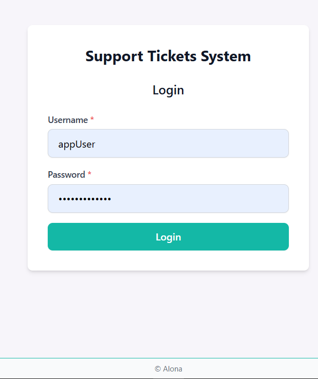
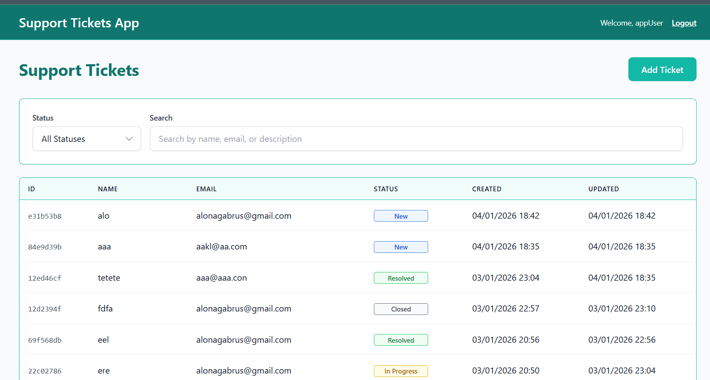
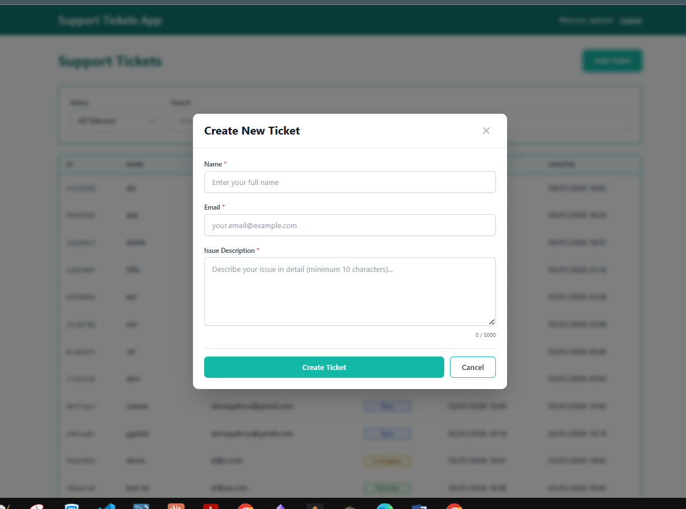
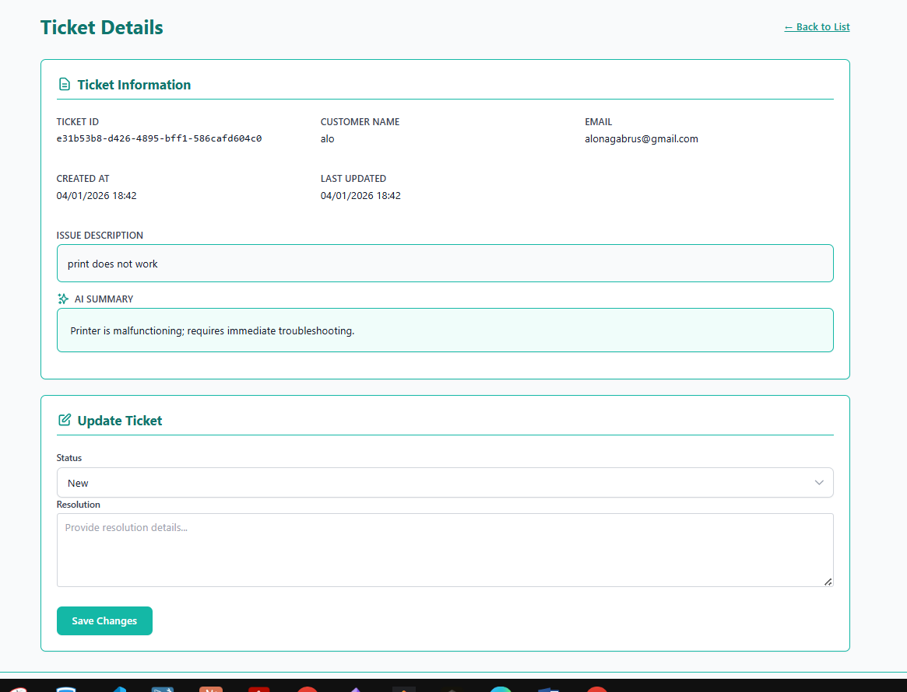

# Support Ticket Management System

A full-stack web application for managing customer support tickets with AI-powered summary generation and email notifications.

## Functionality

- Create, view, update, and filter support tickets
- AI-powered summary generation using OpenAI API
- Email notifications for ticket events
- JWT-based authentication
- Search and filter by status, name, email or description
- Pagination for large ticket lists
- Status tracking (New, In Progress, Resolved, Closed)

**Access Control:**

- Logged-in users can view, add, and edit tickets
- Non-logged users can view tickets list (`/tickets`) and ticket details (read-only)

## Tech Stack

**Backend:**

- .NET 9.0, ASP.NET Core
- JWT Bearer Authentication
- OpenAI SDK (Azure.AI.OpenAI package) for AI summaries
- MailKit for SMTP email
- Swagger for API documentation

**Frontend:**

- React 18, TypeScript
- Vite, Tailwind CSS
- React Router

## Architecture

```
Frontend (React) → REST API → Services Layer → Repository → JSON Storage
```

**Layers:**

- **Endpoints**: RESTful API routes
- **Services**: TicketService, AuthService, SummaryGenerationService, SmtpEmailService
- **Repository**: FileBasedTicketRepository (JSON file storage)

## Security

The following must be excluded from git:

- **OpenAI API Key** (`AiService:ApiKey` in `appsettings.json`)
- **SMTP Credentials** (`Email:SmtpUsername`, `Email:SmtpPassword` in `appsettings.json`) will be provided by whatsapp

Store these in environment variables or a non-committed config file.

## Running Locally

**Prerequisites:** .NET 9.0 SDK, Node.js 18+, OpenAI API key, SMTP credentials

**Backend:**

```bash
cd backend
# Configure appsettings.json with OpenAI API key, SMTP credentials, and auth credentials
dotnet run
```

API available at `http://localhost:5000`. Swagger at root URL in Development mode.

**Frontend:**

```bash
cd frontend
npm install
npm run dev
```

Frontend available at `http://localhost:5173`.

**Test Credentials:**
credentials are in appsettings.json because just for testing purpose

- Username: `appUser`
- Password: `AppUserPwd123`

## Screenshots

### Login Page



The login page provides a clean interface for user authentication.

### Tickets List



The main tickets list page displays all support tickets in a table format. Users can filter tickets by status, search and view ticket details.

### Create Ticket Modal



The create ticket modal allows users to submit new support tickets. Required fields include customer name, email and issue description.

### Ticket Details



The ticket details page shows comprehensive information about a specific ticket, including customer details, issue description, and AI-generated summary. Support staff can update the ticket status and add resolution notes.

## Additional Notes

**Email Service**: Configured with MailSend's free plan, which was blocked after multiple testing attempts. Use a paid email service or alternative SMTP provider for production.
